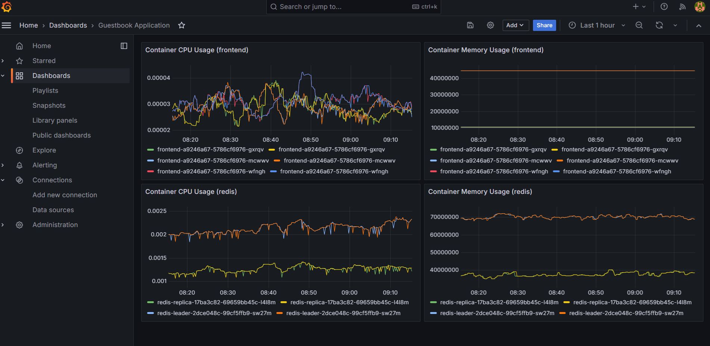

# Kubernetes Guestbook with Prometheus & Grafana Monitoring

This example deploys the simple Kubernetes Guestbook application along with a full monitoring stack (Prometheus + Grafana) using Pulumi and TypeScript.

## Overview

The stack deploys:

- **Frontend** – PHP guestbook web UI
- **Redis Leader** – primary Redis instance with a `redis_exporter` sidecar
- **Redis Replica** – read replicas for Redis with a `redis_exporter` sidecar
- **Blackbox Exporter** – HTTP probe monitoring for the frontend (since the PHP app has no native `/metrics` endpoint)
- **Prometheus** – deployed via the `kube-prometheus-stack` Helm chart (includes Prometheus Operator)
- **Grafana** – visualization dashboard pre-configured with a Prometheus datasource and a Guestbook Application dashboard

## Prerequisites

- [Pulumi CLI](https://www.pulumi.com/docs/get-started/install/)
- [Node.js](https://nodejs.org/) (v18+)
- A running Kubernetes cluster (e.g., Minikube, EKS, GKE, AKS)
- `kubectl` configured to access your cluster
- Helm (used internally by Pulumi for the kube-prometheus-stack chart)

## Deploying the Application

```bash
cd simple

# Install dependencies
npm install

# Create a new stack
pulumi stack init guestbook-stack

# (Optional as this has been set in Pulumi.yaml file too) If using Minikube:
pulumi config (to check the value of isMinikube)
pulumi config set isMinikube true

# Deploy
pulumi up
```

## Outputs

After deployment, Pulumi will output:

| Output                | Description                          |
|-----------------------|--------------------------------------|
| `frontendIp`          | IP/URL of the Guestbook frontend     |
| `grafanaUrl`          | URL to access Grafana                |
| `grafanaAdminUser`    | Grafana admin username               |
| `grafanaAdminPassword`| Grafana admin password               |
| `prometheusUrl`       | URL to access Prometheus             |

## Grafana Access

- **URL**: Shown in `grafanaUrl` output (e.g., `http://<ip>:3000` or `http://localhost:3000` on Minikube)
- **Username**: `admin`
- **Password**: `admin`

A pre-provisioned dashboard named **"Guestbook Application"** is available showing CPU and memory usage for frontend and backend(redis) services.

## Monitoring Architecture

### Prometheus (via kube-prometheus-stack Helm chart)

Prometheus is deployed using the `kube-prometheus-stack` Helm chart with a pinned release name. The Prometheus URL for Grafana is dynamically constructed from the Helm release name and namespace.

### ServiceMonitors (Redis)

- **`redis-leader-monitor`** – scrapes the redis-leader service via a `redis_exporter` sidecar on port `metrics` (9121)
- **`redis-replica-monitor`** – scrapes the redis-replica service via a `redis_exporter` sidecar on port `metrics` (9121)

### Blackbox Exporter + Probe CRD (Frontend)

Since `pulumi/guestbook-php-redis` does not expose a `/metrics` endpoint, the frontend is monitored using:

- **Blackbox Exporter** – deployed in the `monitoring` namespace, performs HTTP probes
- **`blackbox-exporter-monitor` ServiceMonitor** – scrapes the exporter's own metrics
- **`frontend-http-probe` Probe CRD** – tells Prometheus to probe `http://frontend.default.svc.cluster.local:80` through the blackbox exporter

### Metrics Available

| Metric | Source | Description |
|--------|--------|-------------|
| `redis_up` | redis_exporter | Whether Redis is reachable |
| `redis_connected_clients` | redis_exporter | Number of connected clients |
| `redis_commands_total` | redis_exporter | Total commands processed |
| `redis_memory_used_bytes` | redis_exporter | Redis memory usage |
| `probe_success` | blackbox_exporter | 1 if frontend HTTP check passes |
| `probe_duration_seconds` | blackbox_exporter | HTTP probe latency |
| `probe_http_status_code` | blackbox_exporter | Frontend HTTP response code |
| `container_cpu_usage_seconds_total` | cAdvisor/kubelet | CPU usage per container |
| `container_memory_usage_bytes` | cAdvisor/kubelet | Memory usage per container |

## Verifying Metrics Are Being Scraped

```bash
# Port-forward to Prometheus UI
kubectl port-forward -n monitoring svc/kube-prometheus-stack-prometheus 9090:9090

# 1.) Check the status of configured scrape targets (frontend-http-probe, blackbox-exporter-monitor, redis-leader-monitor, redis-replica-monitor)

# Go to Status → Targets (http://localhost:9090/targets) to view:
Target state (UP / DOWN)
Last scrape time
Scrape duration
Errors

# 2.) Send HTTP request through the Guestbook UI and Query metrics from Prometheus

# Port-forward to Guestbook UI (frontend)
kubectl port-forward svc/frontend 8080:80

# In the Guestbook application (frontend) browser (http://localhost:8080):
Send a http request by entering a message and clicking `Submit` button

# In the Prometheus expression browser (http://localhost:9090/graph):
Enter any of the queries stated below and click the `Execute` button

# Check probe results (frontend HTTP check)
# result of 1 implies frontend is responding with http 200; 0 implies frontend is down
probe_success{job="frontend-http-probe"}

# Check Probe duration - how long the http request took (latency)
probe_duration_seconds{job="frontend-http-probe"}

# Check http status code returned
probe_http_status_code{job="frontend-http-probe"}

# Check response body size
probe_http_content_length{job="frontend-http-probe"}

# Check DNS resolution time
probe_dns_lookup_time_seconds{job="frontend-http-probe"}

# Check Redis metrics (should return data if redis-exporter is working)
redis_up

# 3.) Query resources directly from the terminal (optional)

# i) Check ServiceMonitor resources exist
kubectl get servicemonitors -n monitoring

# ii) Check Probe resources exist
kubectl get probes -n monitoring

# iii) Check Prometheus is picking up the config
kubectl get prometheus -n monitoring -o yaml | grep serviceMonitor
```

## Viewing Grafana Dashboard

```bash
# Port-forward to Grafana UI
kubectl port-forward -n monitoring svc/grafana 3000

# Open http://localhost:3000/dashboard to see the Guestbook Application Dashboard

# Click Guestbook Application dashboard to view resource usage metrics:
# Container CPU Usage (frontend)
# Container Memory Usage (frontend)
# Container CPU Usage (redis)
# Container Memory Usage (redis)
```



## Cleaning Up

```bash
pulumi destroy
pulumi stack rm guestbook-stack
```